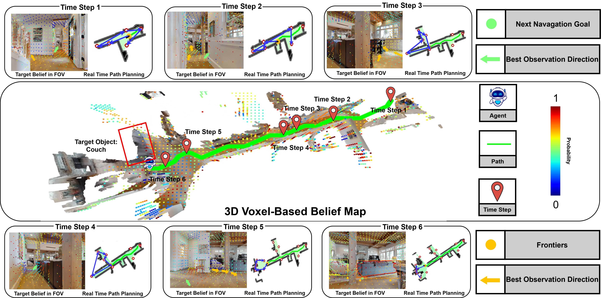

<p align="center">
  
  <h1 align="center">BeliefMapNav: 3D Voxel-Based Belief Map for Zero-Shot Object Navigation</h1>
  <h3 align="center">
    Zibo Zhou, Yue Hu, Lingkai Zhang, Zonglin Li, Siheng Chen
  </h3>
  <p align="center">
    <a href="https://arxiv.org/abs/2506.06487">Paper (arXiv)</a>
  </p>
</p>

## :sparkles: Overview

Zero-shot object navigation (ZSON) allows robots to find target objects in unfamiliar environments using natural language instructions, without relying on pre-built maps or task-specific training. Recent general-purpose models, such as large language models (LLMs) and vision-language models (VLMs), equip agents with semantic reasoning abilities to estimate target object locations in a zero-shot manner. However, these models often greedily select the next goal without maintaining a global understanding of the environment and are fundamentally limited in the spatial reasoning necessary for effective navigation. To overcome these limitations, we propose a novel 3D voxel-based belief map that estimates the target’s prior presence distribution within a voxelized 3D space. This approach enables agents to integrate semantic priors from LLMs and visual embeddings with hierarchical spatial structure, alongside real-time observations, to build a comprehensive 3Dglobal posterior belief of the target’s location. Building on this 3D voxel map, we introduce BeliefMapNav, an efficient navigation system with two key advantages: i) grounding LLM semantic reasoning within the 3D hierarchical semantics voxel space for precise target position estimation, and ii) integrating sequential path planning to enable efficient global navigation decisions. Experiments on HM3D and HSSD benchmarks show that BeliefMapNav achieves state-of-the-art (SOTA) Success Rate (SR) and Success weighted by Path Length (SPL), with a notable 9.7 SPL improvement over the previous best SR method, validating its effectiveness and efficiency. We will release the code of BeliefMapNav.

## Installation

### Getting Started
Create the conda environment:
```bash
conda_env_name=bmn
conda create -n $conda_env_name python=3.9 -y
conda activate $conda_env_name
pip install torch==1.12.1+cu113 torchvision==0.13.1+cu113 -f https://download.pytorch.org/whl/torch_stable.html
pip install git+https://github.com/IDEA-Research/GroundingDINO.git@eeba084341aaa454ce13cb32fa7fd9282fc73a67 salesforce-lavis==1.0.2
pip install -r environment.txt
```
If you are using habitat and are doing simulation experiments, install this repo into your env with the following:
```bash
pip install git+https://github.com/facebookresearch/habitat-sim.git@v0.2.5
git clone https://github.com/facebookresearch/habitat-lab.git
git checkout v0.2.5
```

You need to replace the source code of nv_utils.py in habitat-lab with BeliefmapNav/habitat_lab/env_utils.py for resume the eval.
```bash
cd habitat-lab
pip install -e habitat-lab
pip install -e habitat-baselines
cd ..
```
#### [Whether you're using conda or not]
Clone the following repo within this one (simply cloning will suffice):
```bash
git clone git@github.com:WongKinYiu/yolov7.git
```

## :dart: Downloading the HM3D dataset

### Matterport
First, set the following variables during installation (don't need to put in .bashrc):
```bash
MATTERPORT_TOKEN_ID=<FILL IN FROM YOUR ACCOUNT INFO IN MATTERPORT>
MATTERPORT_TOKEN_SECRET=<FILL IN FROM YOUR ACCOUNT INFO IN MATTERPORT>
DATA_DIR=</path/to/vlfm/data>
HM3D_OBJECTNAV=https://dl.fbaipublicfiles.com/habitat/data/datasets/objectnav/hm3d/v1/objectnav_hm3d_v1.zip
```

### Clone and install habitat-lab, then download datasets
*Ensure that the correct conda environment is activated!!*
```bash
# Download HM3D 3D scans (scenes_dataset)
python -m habitat_sim.utils.datasets_download \
  --username $MATTERPORT_TOKEN_ID --password $MATTERPORT_TOKEN_SECRET \
  --uids hm3d_train_v0.2 \
  --data-path $DATA_DIR &&
python -m habitat_sim.utils.datasets_download \
  --username $MATTERPORT_TOKEN_ID --password $MATTERPORT_TOKEN_SECRET \
  --uids hm3d_val_v0.2 \
  --data-path $DATA_DIR &&

# Download HM3D ObjectNav dataset episodes
wget $HM3D_OBJECTNAV &&
unzip objectnav_hm3d_v1.zip &&
mkdir -p $DATA_DIR/datasets/objectnav/hm3d  &&
mv objectnav_hm3d_v1 $DATA_DIR/datasets/objectnav/hm3d/v1 &&
rm objectnav_hm3d_v1.zip
```

## :weight_lifting: Downloading weights for various models
The weights for MobileSAM, GroundingDINO, and PointNav must be saved to the `data/` directory. The weights can be downloaded from the following links:
- `mobile_sam.pt`:  https://github.com/ChaoningZhang/MobileSAM
- `groundingdino_swint_ogc.pth`: https://github.com/IDEA-Research/GroundingDINO
- `yolov7-e6e.pt`: https://github.com/WongKinYiu/yolov7
- `pointnav_weights.pth`: included inside the [data](data) subdirectory


We use finetuned version of semantic segmentation model [RedNet](https://github.com/JindongJiang/RedNet). 
Therefore, you need to download the [segmentation model](https://drive.google.com/file/d/1U0dS44DIPZ22nTjw0RfO431zV-lMPcvv/view) in data path.

## :arrow_forward: Evaluation within Habitat
If you want to run the evaluation, you only need to run the following command. The number and IDs of the GPUs, as well as the number of episodes to evaluate on each GPU, can be modified within the file:
```bash
.scripts/launch_multi_eval.sh
```
(You may need to run `chmod +x` on this file first.)

## Acknowledgements

This repo is heavily based on [VLFM](https://github.com/bdaiinstitute/vlfm), and referenced the code in [Stairway to Success](https://github.com/Zeying-Gong/ascent) in for the robot's stair-climbing/ascending and descending capabilities. We thank the authors for their great work.

## :newspaper: License

VLFM is released under the [MIT License](LICENSE). This code was produced as part of Naoki Yokoyama's internship at the Boston Dynamics AI Institute in Summer 2023 and is provided "as is" without active maintenance. For questions, please contact [Naoki Yokoyama](http://naoki.io) or [Jiuguang Wang](https://www.robo.guru).

## :black_nib: Citation

If you use VLFM in your research, please use the following BibTeX entry.

```
@article{zhou2025beliefmapnav,
  title={BeliefMapNav: 3D Voxel-Based Belief Map for Zero-Shot Object Navigation},
  author={Zhou, Zibo and Hu, Yue and Zhang, Lingkai and Li, Zonglin and Chen, Siheng},
  journal={arXiv preprint arXiv:2506.06487},
  year={2025}
}
```